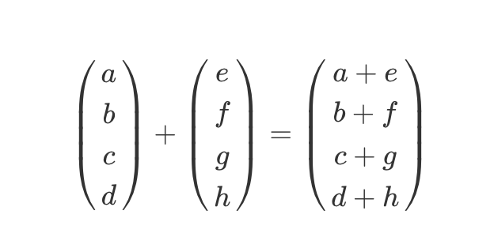

R Puede verse inicialmente como una calculadora Observa:

```{r}
2+2
```

Entonces hay operaciones matematicas que puede realizarse de manera directa en la consola:  operadores matemáticos

suma (+)
resta (-)
multiplicacion (*)
Division (/)
Potenciacion ('^')

En el siguiente espacio realiza alguna operaciones por tu cuenta utilizando los operadores anteriores:

Debes utilizar el espacio definido en este notebook, de lo contrario deberias escribirlo en la consola de manera directa

ejecute en R que calcule las siguientes operaciones: (Ejercicio)

2 multiplicado por 2
3 al cuadrado
2 dividido 3
5 por 8 más 1

```{r}
# Escribir aca el la operaciones ejecutandolo y observando el resultado


```


Al hacer todas estas operaciones, lo único que hizo fue decirle a R que haga esos cálculos. R te devuelve el resultado, pero no lo guarda en ningún lado. Para decirle que guarde el resultado de una operación hay que decirle con qué “nombre” quiere que lo guarde. El siguiente código hace eso:

```{r}
x <- 2 + 2
```

La “flechita” **<-** es el operador **asignación**, que le dice a R que tome el resultado de la derecha y lo guarde en una variable con el nombre que está a la izquierda. Vas a ver que no te devuelve el resultado. Para verlo, ejecutamos:

```{r}
x
```

Esto le dice a R que te “imprima” el contenido de la variable x.

Reglas para el nombre de los objetos/variables:

1. No iniciar con numero o raya al piso (_)
2. si consta de dos palabras no puede ir espacio entre ellas use guion al piso para unirlas
3. use nombres cortos que hagan referencia a su contenido
4. En lo posible use minusculas

# Objetos en R

¿Que tipos de objetos podemos crear y manipular en R?


El mas elemental de todos:

- Vectores : concatenacion de valores numericos o caracter **IMPORTANTE: SOLO PUEDE CONCATENAR UNA SOLA CLASE DE VALOR** Solo numerico o solo caracter, sin combina ocurrira la coercion hacia texto.

para crear este elemental objeto se usa el operador c() asi:

```{r}
c(3,4,2,8,5)
c("italia", "canada", "egipto")
c(4,5,2,"italia")
```

el codigo anterior solo imprime el objeto pero no lo guarda para usarlo despues, agrega un nombre y el operador <- para guardarlos

- Matriz: Estructura de objeto en fila x columna, solo acepta que sus componentes sea de un misma clase de valor (numerico o texto)

```{r}
matrix(c(1,2,3,4), nrow = 2, ncol = 2)
matrix(c("italia", "canada", "egipto", "inglaterra"), nrow = 2, ncol = 2)
```

- lista: Objeto que concatena en cada uno de sus componente un objeto distinto de los anteriormente estudiados, se crea con list()

```{r}
x <- c(23,43,25,76,45)
l <- c(1,2,3,4,5)
y <- c("Si", "No")
m <- matrix(c(4,2,3,5), nrow = 2, ncol = 2)
list(x,y,m)
```

- dataframe: Un marco de datos es cómo R almacena un conjunto de datos típico. Consiste en vectores (columnas) de datos unidos entre sí, que tienen el mismo número de observaciones (filas). pero pueden ser de diferentes clases de valores. se crean en R con la función data.frame().

las columnas tienen un nombre (variables) y las filas corresponden a los registros

```{r}
# Dataframe creado en R

dataset <- data.frame(edad = c(23,45,34,32,65),
           sexo = c("F","M","F","F","M"),
           hipertenso = c(0,1,0,0,1))
dataset
```

# Manipulacion de objetos 

La manipualcion basica de los objetos esta relacionada principalmente en extraer valores del objeto, cambiar valores de los objeto, realizaar operaciones entre objetos.

- Extracción de valores de un objeto: para **vectores** se basa en el posición donde se ubica el valor deseado y corchetes [] :

```{r}
x
# extraccion de un unico valor
x[2]
# extraccion de dos valores secuenciales
x[2:4]
#extraccion de de valores NO secuenciales
x[c(1,4)]
```

Para un **Dataframe** como es un objeto compuesto por union de vectores tiene dos formas:

extrae un vector completo mediante el operador pesos,  asi: nombre_objeto$nombre_vector

```{r}
dataset$edad
```

Extrayendo un valor especifico por posición: nombre_objeto[posicion fila, posicion columna]:

```{r}
dataset[1,2]
dataset[3,3]
```

Un conjunot de valores o vectores
```{r}
dataset[,2:3]
dataset[1:3,]
```

- Opearaciones entre objetos

```{r}
x
x*2
```

operación entre vectores



```{r}
x
l
x*l
```

operacion con dataframe

```{r}
edad_meses <- dataset$edad*12
edad_meses
dataset[,"edad_meses"] <- edad_meses
```

# Ejercicios

1. Ejecute las siguientes lineas donde se crea una dataframe, luego cree un nuevo vector llamado temp_c con el vector/columna temp_f del dataframe y luego agreguela al dataframe como una variable mas.

la formula es: temp_c = 5/9 × (temperatura − 32)

```{r}
temp_f <- c(35, 88, 42, 84, 81, 30)
city <- c("Beijing", "Lagos", "Paris", "Rio de Janeiro","San Juan", "Toronto")
city_temps <- data.frame(name = city, temperature = temp_f)
```

2. ejecute la siguiente linea con la cual instalara una libreria (lo explicare mas adelante) y accederemos a un dataset de muertes por arma de fuego en USA para el 2010

```{r}
install.packages("dslabs")
library(dslabs)
data("murders")
head(murders)
```

- imprima en pantalla los primeros 10 estados en el dataset con su poblacion total y numero de homicidios

```{r}

```

- extraiga los nombres de las regiones del dataset
```{r}

```

- Calcule la tasa de asesinatos por cada 100000 para cada estado y almacénela en el objeto murder_rate (muertes/poblacion x 100000)

$$tasa = \frac{total}{poblacion}\times 100000$$
```{r}

```

- Agregue ese nuevo vector creado en el punto anterior al dataset murders

```{r}

```

